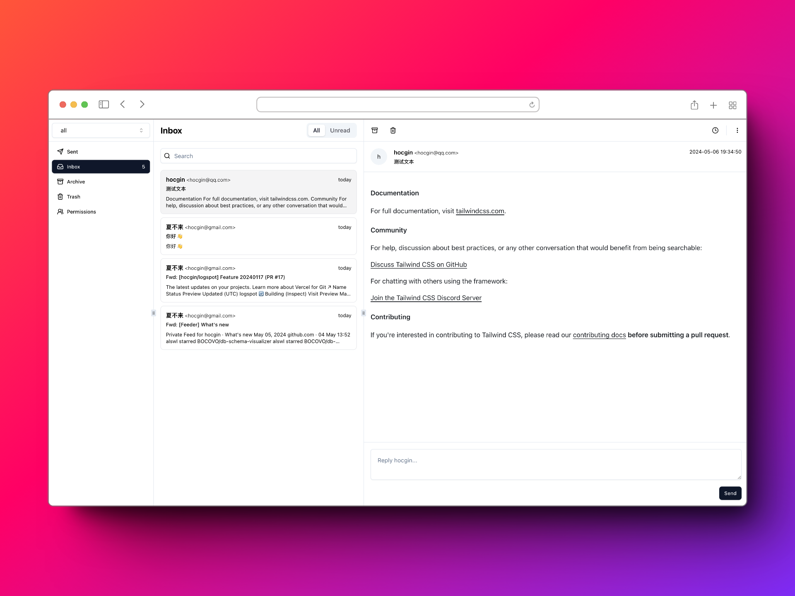
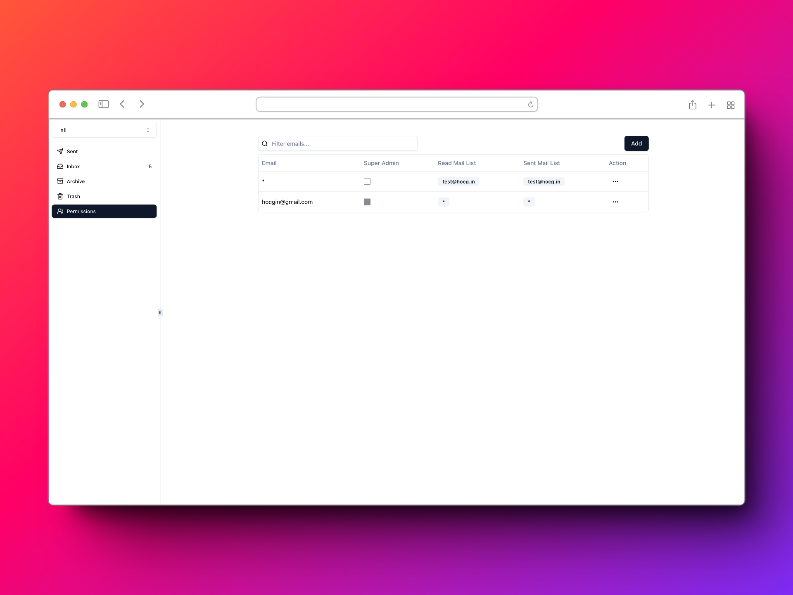
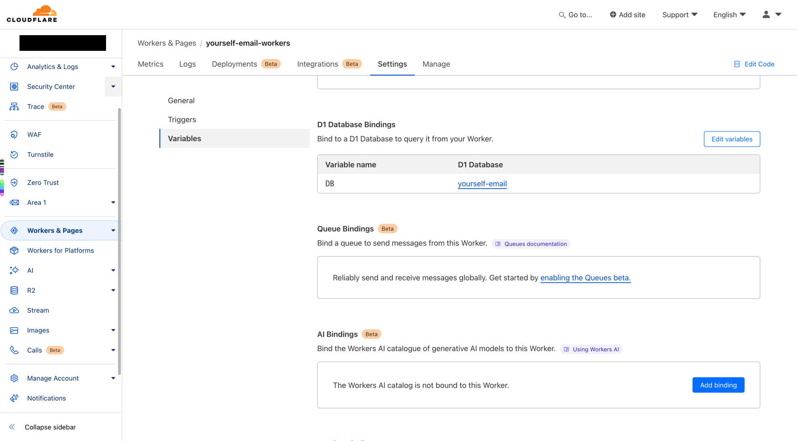
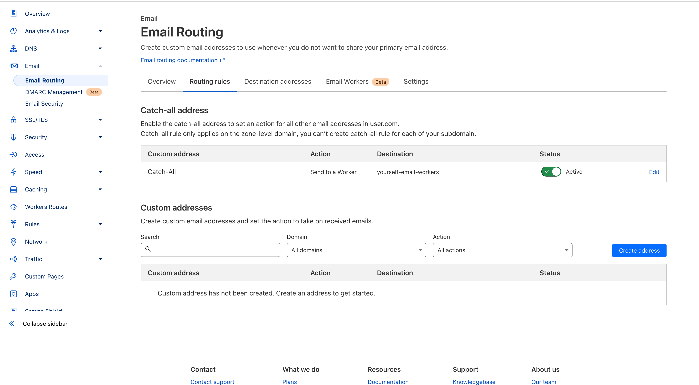
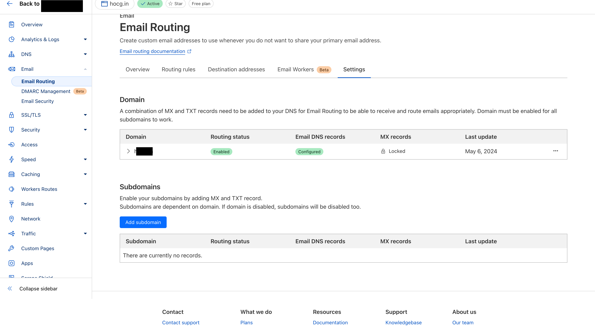
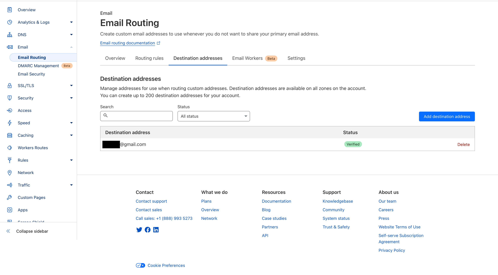
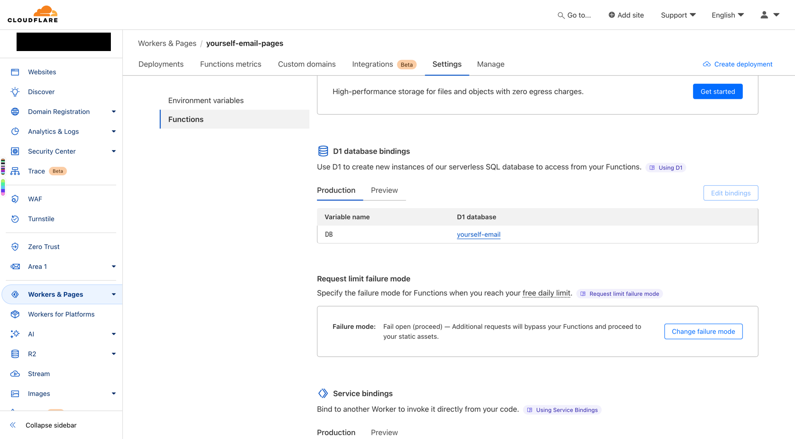
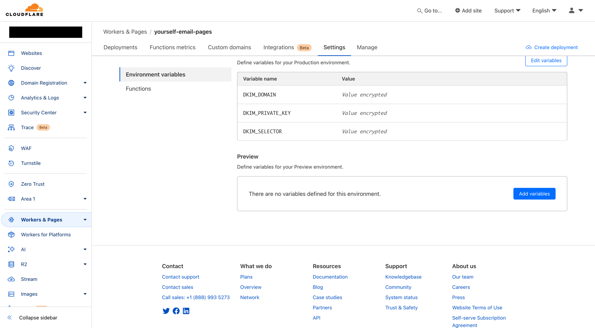

# yourself-email

> Use Cloudflare to build your own email system, no servers required

[中文文档](README-zh-CN.md)

### Show Demo

> Demo address: http://mail.hocg.in, use any email to log in.
>
> Read/Sent mailbox: test@hocg.in and test2@hocg.in

<div style="display:inline-block">
  
  
</div>

### Deployment

<details open>
<summary>1. Create database</summary>

#### Initialize database

```shell
# Create database
npx wrangler d1 create yourself-email

# Write the database configuration displayed on the console pages/wrangler.toml and workers/wrangler.toml to [[d1_databases]]

cd pages

# Execute table creation statement
npx wrangler d1 execute yourself-email --remote --file=./migrations/0001_create_table.sql

# =========== ⚠️ Configure permissions ===========
# Configure super administrator permissions
npx wrangler d1 execute yourself-email --remote --command "INSERT INTO UserConfig(email, is_super_admin, read_mail, sent_mail) VALUES ('hocgin@gmail.com', true, '*', '*')";
# Configure default login account permissions
npx wrangler d1 execute yourself-email --remote --command "INSERT INTO UserConfig(email, is_super_admin, read_mail, sent_mail) VALUES ('*', false, 'test@hocg.in', 'test@hocg.in')";
```

</details>

<details open>
<summary>2. Deploy email receiver(Workers) / incoming mail</summary>

#### Deployment project

```shell
cd workers

npm run deploy
```

#### Configuration items

##### Configuration database D1

Select database `yourself-email`, and set the variable name to `DB`



##### Configuration Email Routing

1. logIn [Cloudflare](https://dash.cloudflare.com/) Choose the domain name you want to use
2. Enter the menu on the left Email > Email Routing > Email Workers，Enabled Email Routing
3. Specify forward to `yourself-email-workers`
   
4. Configure domain DNS
   

⚠️ A verified email address needs to be added here


#### Configure domain name resolution

</details>

<details>
<summary>3. Deploy email Pages / send email</summary>

#### Deployment project

```shell
cd pages

npm run deploy
```

#### Configuration

##### Configuration database D1

Select database `yourself-email`, and set the variable name to DB



#### Configure DNS resolution(Domain Lockdown)

> Configure to allow sending emails through the pages domain name

| record        | type | content                                         |
|---------------|------|-------------------------------------------------|
| @             | TXT  | v=spf1 a mx include:relay.mailchannels.net ~all |
| _mailchannels | TXT  | v=mc1 cfid=yourself-email-pages.pages.dev       |

#### Configure DKIM, optional + recommended

> DKIM is a DNS record that helps prevent email spoofing and can improve email deliverability.

##### Generate private keys and DNS records

```shell
# Generate private key
openssl genrsa 2048 | tee private_key.pem | openssl rsa -outform der | openssl base64 -A > private_key.txt

# Generate DNS records
echo -n "v=DKIM1;p=" > dkim_record.txt && openssl rsa -in private_key.pem -pubout -outform der | openssl base64 -A >> dkim_record.txt
```

##### Configure DNS resolution

| record                  | type | content                                                                                                                | explanation                                         |           
|-------------------------|------|------------------------------------------------------------------------------------------------------------------------|-----------------------------------------------------|
| _dmarc                  | TXT  | v=DMARC1; s=mailchannels; p=reject; adkim=s; aspf=s; rua=mailto:xxx@gmail.com; ruf=mailto:xxx@gmail.com pct=100; fo=1; | Strict mode, please replace yourself to the mailbox |
| _dmarc                  | TXT  | v=DMARC1; s=mailchannels; p=none; adkim=r; aspf=r;                                                                     | Relaxed mode                                        |
| mailchannels._domainkey | TXT  | `dkim_record.txt content`                                                                                              |                                                     |

- v=DMARC1: Specify the version of the DMARC record, here is version 1.
- s=mailchannels: Indicates the domain of the DMARC policy, here is mailchannels.
- p=reject: defines what the recipient should do if the email fails DMARC verification. Here is reject, which means
  directly rejecting the email.
- adkim=s: specifies the domain name authentication signature (DKIM) policy, here is s (strict), which means that the
  DKIM signature must be verified.
- aspf=s: Specifies the policy of the Sender Policy Framework (SPF), here it is s (strict), which means that the SPF
  record must be verified.
- rua=mailto:YYY: Specifies the email address for failure reports. When an email fails DMARC verification, the recipient
  sends a report to this address. mailto:YYY
  Needs to be replaced with actual email address.
- ruf=mailto:YYY: Specifies the email address of the failure report, which is used to send more detailed failure
  information. Likewise, mailto:YYY needs to be replaced with the actual email address.
- pct=100: Defines the percentage of emails checked by DMARC. Here it is 100, meaning all emails will be checked.
- fo=1: Specifies options for failure reporting. 1 means to report all failed records instead of only those that failed
  the DMARC policy.
  (Note: the complete definition of the fo parameter seems to be missing from the string you provided, typically it may
  contain multiple options, such as 1 to request a complete failure report)

##### Configure DKIM variables(Pages)

- DKIM_DOMAIN: Email domain, 如: hocg.in
- DKIM_SELECTOR: `dmarc` 中 s= Field content, 填 `mailchannels`
- DKIM_PRIVATE_KEY: `private_key.txt` document content



</details>

----

### ToDoList

<details>

<summary>ToDoList</summary>

- [x] Mark as read
- [x] Archive
- [x] Recycle Bin
- [ ] Recycle bin, complete deletion
- [ ] Add labels to emails
- [ ] Email details, the sender displays the email header information
- [x] Email details, query communication history with user X
- [x] Permission design and implementation
- [x] User status, query the unread quantity and authorized account list
- [ ] Support rich text editor
- [ ] Organize/Develop API interface

</details>

----

### Ref

- [Shadcn UI](https://ui.shadcn.com/)
- [Prisma](https://www.prisma.io)
- [Cloudflare D1](https://developers.cloudflare.com/d1/build-with-d1)
- [MailChannels API](https://api.mailchannels.net/tx/v1/documentation)

