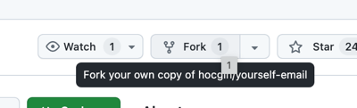
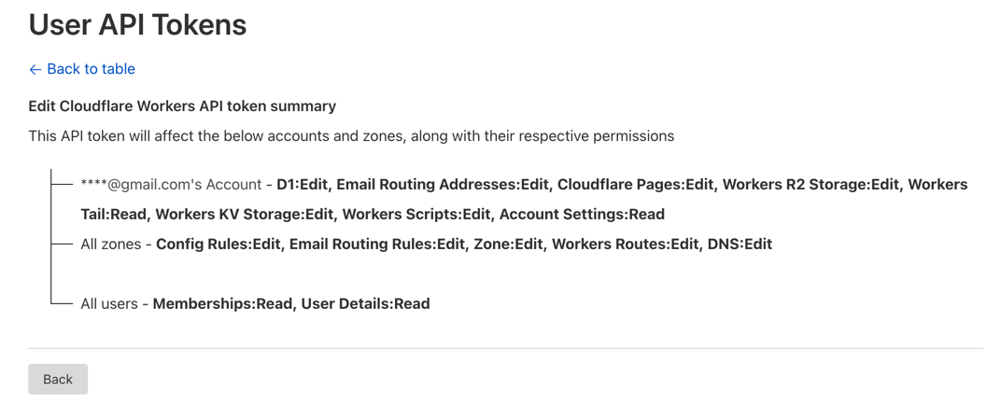
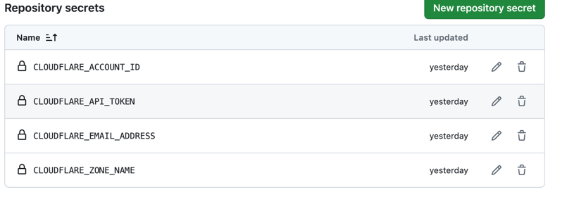
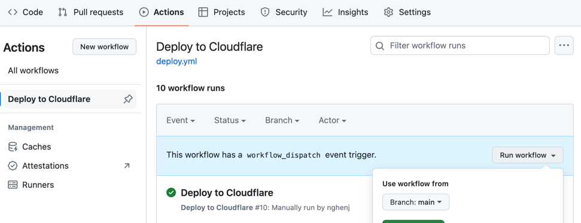

### 操作流程
> - If the installation fails, please refer to the [Preconditions](../zh-CN/Reinstall.md)
> - Frequently Asked Questions Reference: [FAQ](../zh-CN/FAQ.md)

1. Click `fork`

2. Click [Cloudflare Token](https://dash.cloudflare.com/profile/api-tokens), create `API Tokens`

3. Configure environment variables  

- CLOUDFLARE_API_TOKEN=from_cloudflare_token
- CLOUDFLARE_ACCOUNT_ID=from_cloudflare_account_id
- CLOUDFLARE_ZONE_NAME=example.com
- CLOUDFLARE_EMAIL_ADDRESS=xxx@gmail.com
4. trigger deployment

5. Visit your email address and use the email address filled in "CLOUDFLARE_EMAIL_ADDRESS" to log in.
